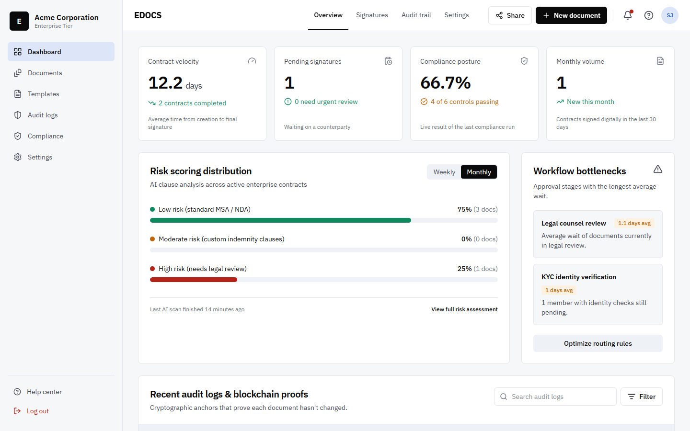
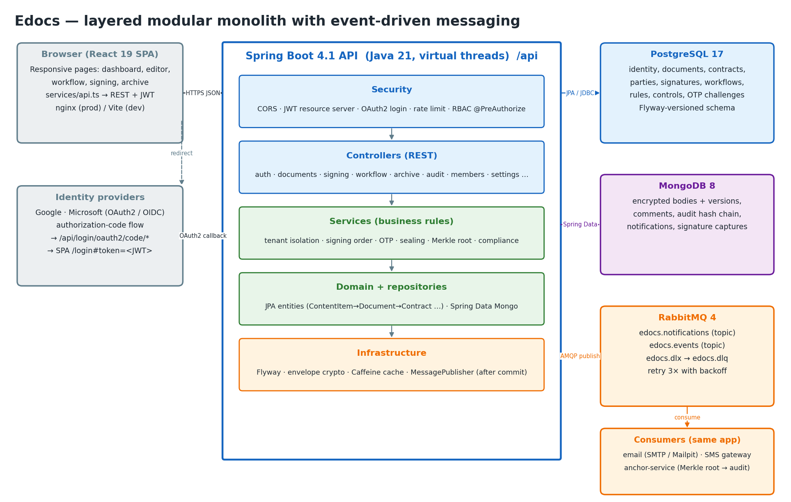

# Edocs

Edocs is a platform for e-contracts, e-signatures and tamper-evident archiving. An organization drafts contracts from templates, sends them out for review, collects signatures in a set order with one-time codes, and stores the sealed result in a WORM archive. Every action goes into a hash-chained audit trail.

This is the Web Technology final project. The repository holds two applications and their documentation:

| Folder | What it is |
| --- | --- |
| [`edocs_frontend/`](edocs_frontend) | React 19 + TypeScript + Tailwind CSS v4 single-page app (Vite) |
| [`edocs_backend/`](edocs_backend) | Spring Boot 4.1 REST API on Java 21, using PostgreSQL, MongoDB and RabbitMQ |
| [`documentation/`](documentation) | Assignment brief, project report, implementation log, diagrams, screenshots |
| `docker-compose.yml` | The full stack in one command |
| `.github/` | CI pipeline and Dependabot |



---

## Contents

1. [Quick start](#quick-start)
2. [Running each part](#running-each-part)
3. [Demo accounts](#demo-accounts)
4. [System design](#system-design)
5. [How it works](#how-it-works)
6. [Security](#security)
7. [Configuration](#configuration)
8. [Testing and CI](#testing-and-ci)
9. [API overview](#api-overview)
10. [Further reading](#further-reading)

---

## Quick start

### Option 1: the whole stack in Docker (recommended)

You need Docker Desktop (on Windows, with WSL 2).

```bash
docker compose up --build
```

| Service | URL |
| --- | --- |
| Web app | http://localhost:5173 |
| API + Swagger UI | http://localhost:8080/api/docs |
| RabbitMQ management | http://localhost:15672 (user `edocs`, password `edocs`) |
| Mailpit (catches all outgoing email) | http://localhost:8025 |
| PostgreSQL | `localhost:5433`, database / user / password `edocs` |
| MongoDB | `localhost:27017` |

The backend creates the schema with Flyway and seeds a demo workspace on first start. To start from an empty database again, run `docker compose down -v`.

### Option 2: frontend only (no backend)

The frontend has a built-in mock database that runs in the browser. You only need Node.js 22+.

```bash
cd edocs_frontend
npm install
npm run dev        # http://localhost:5173
```

---

## Running each part

### Backend

Prerequisites: JDK 21. Maven is not required because the project ships the Maven wrapper (`mvnw` / `mvnw.cmd`).

**A. Without Docker.** This mode starts in-process stand-ins (embedded PostgreSQL, a MongoDB-wire server and a Qpid AMQP broker) from test-scope dependencies, so nothing else needs to be installed:

```bash
cd edocs_backend
./mvnw spring-boot:test-run -Dspring-boot.run.main-class=com.edocs.LocalDevApplication
```

**B. With your own PostgreSQL, MongoDB, RabbitMQ and SMTP (real data):**

Keys and connection settings live in `edocs_backend/.env`, which `application.yml` imports (`spring.config.import: optional:file:.env[.properties]`). Real environment variables still override it.

```bash
cd edocs_backend
cp .env.example .env   # then set JWT_SECRET, MASTER_KEY and the connection values
./mvnw spring-boot:run
```

With `DEMO_MFA_CODE` empty and `OTP_ECHO_IN_APP=false`, sign-in and signing codes really travel PostgreSQL → RabbitMQ (`edocs.notifications.email`) → SMTP, so open Mailpit (http://localhost:8025) to read them.

Without Docker, every service also runs from portable downloads, no admin rights needed: PostgreSQL (installer or service) with role/database `edocs`, the MongoDB 8 Windows zip, the Erlang/OTP 28 Windows zip plus the RabbitMQ 4.3 Windows zip (`ERLANG_HOME` set, `rabbitmq-plugins enable rabbitmq_management`, user `edocs`/`edocs`), and the Mailpit binary.

**C. Infrastructure in Docker, backend from your IDE:**

```bash
docker compose up -d postgres mongo rabbitmq mailpit
# Postgres is published on 5433, so point DB_URL at it
export DB_URL=jdbc:postgresql://localhost:5433/edocs RABBIT_USER=edocs RABBIT_PASSWORD=edocs
./mvnw spring-boot:run -Dspring-boot.run.profiles=dev
```

The API listens on http://localhost:8080/api. Useful endpoints:

- Swagger UI: `/api/docs`
- OpenAPI JSON: `/api/v3/api-docs`
- Health: `/api/actuator/health` (with `/liveness` and `/readiness` probes)
- Metrics: `/api/actuator/metrics`, `/api/actuator/prometheus`

### Frontend

Prerequisites: Node.js 22+.

```bash
cd edocs_frontend
npm install
cp .env.example .env   # VITE_API_BASE_URL=http://localhost:8080/api connects to the real API
npm run dev            # dev server on http://localhost:5173 (or: npm run dev -- --port 3000)
npm run build          # type-check and production build into dist/
npm run preview        # serve the production build
npm test               # Vitest unit tests
```

`VITE_API_BASE_URL` in `.env` chooses the data source:

- **Empty**: mock mode. Data lives in an in-browser mock database (`src/services/mockDb.ts`). Settings → *Reset demo data* restores the samples.
- **`http://localhost:8080/api`**: the real backend. After every write the client refreshes open screens, again 1.5 s later (to pick up notifications written by the RabbitMQ consumers), on tab focus and every 30 s. A 401 from the API ends the session and returns to sign-in.

The backend allows CORS from ports 5173, 4173 and 3000 by default. If you serve the frontend from another origin, add it to `CORS_ORIGINS`.

---

## Demo accounts

These accounts are seeded on first start, both in the backend and in mock mode. They all use the password **`Demo@2026`**.

| Role | Email | What to try |
| --- | --- | --- |
| Admin | `j.davis@acme.corp` | Has MFA turned on. The code is emailed (see Mailpit). The `dev` profile and mock mode also accept `246810`. |
| Legal counsel | `s.jenkins@acme.corp` | Draft, share and send contracts |
| Signer | `m.vance@partnercorp.io` | The Q3 MSA is waiting for this signature |
| Auditor | `e.rostova@acme.corp` | Read-only archive and audit trail |

**Signing codes.** In the `dev` profile and in mock mode, the one-time signing code is also copied into the in-app notification bell, so you can complete a signature without a phone.

---

## System design

### Architecture



```
            ┌──────────────────────────────┐
 Browser ──▶│  React SPA (nginx in Docker) │
            └──────────────┬───────────────┘
                           │ REST/JSON + Bearer JWT
            ┌──────────────▼───────────────────────────────────────────┐
            │  Spring Boot API  (/api)                                 │
            │  security · identity · document · signing · workflow     │
            │  audit · notification · compliance · dashboard           │
            └──────┬──────────────────┬───────────────────┬────────────┘
                   │ JPA + Flyway     │ Spring Data       │ AMQP (after commit)
            ┌──────▼──────┐    ┌──────▼──────┐     ┌──────▼──────┐
            │ PostgreSQL  │    │  MongoDB    │     │  RabbitMQ   │──▶ email (SMTP) / SMS
            │ relational  │    │ documents,  │     │ events,     │──▶ anchoring listener
            │ core        │    │ audit, etc. │     │ notifications│──▶ dead-letter queue
            └─────────────┘    └─────────────┘     └─────────────┘
```

The backend is a **layered modular monolith**: one deployable, split into feature packages, with each package containing controller → service → repository layers. Side effects such as email, SMS and anchoring run asynchronously over RabbitMQ. This is phase 1 of the hybrid approach in the project document. Because the modules communicate through services and events, they can be split into separate services later.

### Backend modules (`edocs_backend/src/main/java/com/edocs`)

| Package | Responsibility |
| --- | --- |
| `identity` | Organizations (tenants), users, memberships, login, MFA, members, workspace settings |
| `document` | Content items, documents, contracts, parties, templates, shares, WORM archive |
| `signing` | OTP intent-to-sign, signature capture, evidence hashes, Merkle anchoring listener |
| `workflow` | Contract workflows and steps, routing rules, scheduled review escalation |
| `audit` | Append-only, hash-chained audit log and chain verification |
| `notification` | In-app notifications plus email and SMS dispatch |
| `compliance` | Compliance controls evaluated against live data |
| `dashboard` | KPIs, risk bands, workflow bottlenecks (cached with Caffeine) |
| `messaging` | RabbitMQ topology, after-commit publisher, consumers |
| `security` | JWT resource server, OAuth2 login, RBAC matrix, rate limiting, token denylist |
| `common` | Error handling, hashing, envelope encryption, HTML sanitizer |
| `seed` | Demo workspace seeder |

### Data storage: polyglot persistence

| Store | Holds | Why |
| --- | --- | --- |
| **PostgreSQL 17** (schema in `db/migration/V1__init_schema.sql`) | organizations, users, memberships, templates, documents, contracts, parties, shares, signatures, workflows, routing rules, compliance controls, OTP challenges | Relational integrity and transactions for the core business entities |
| **MongoDB 8** | encrypted document bodies with version snapshots and comments, audit log, notifications, raw signature captures | Schema-flexible, append-heavy and large payloads |
| **RabbitMQ 4** | `edocs.notifications` exchange (email and SMS queues), `edocs.events` exchange (document lifecycle), dead-letter `edocs.dlx` → `edocs.dlq` | Asynchronous, retryable side effects |

Diagrams: [ER diagram](documentation/diagrams/er_diagram.png) · [domain concepts](documentation/diagrams/domain_concepts.png) · [messaging](documentation/diagrams/messaging.png) · [class diagram](documentation/edocs_class_diagram_v4.png)

### Domain model, in short

`ContentItem` → `Document` → `Contract`. A contract has `Party` rows (signers and others) with a `signatureOrder`. It is created from a `Template`, moves through a `Workflow` made of `WorkflowStep`s, and collects `Signature`s. Everything belongs to an `Organization`, and users join one through a `Membership` that has a `Role`.

Document lifecycle:

```
draft ──▶ in_review ──▶ out_for_signature ──▶ signed ──▶ archived
                                   ▲    │
                                   └────┘  (one signer at a time, in order)
```

### Frontend structure (`edocs_frontend/src`)

| Folder | Contents |
| --- | --- |
| `pages/` | One component per route: dashboard, documents, editor, workflow, sign, archive, templates, compliance, settings, help, login |
| `services/api.ts` | **The single data boundary.** Every call has a mock implementation and a REST implementation, chosen by `VITE_API_BASE_URL`. |
| `services/mockDb.ts` | The in-browser mock database |
| `state/` | Auth and toast providers |
| `lib/` | RBAC (`rbac.ts`, mirrors the backend matrix), `useResource` hook, DOMPurify sanitizer, download helpers |
| `components/` | Shared UI, modals, route guards, signature pad |
| `layouts/AppShell.tsx` | Sidebar, top bar, notifications, user menu |

| Route | Screen |
| --- | --- |
| `/login` | Password, Google/Microsoft SSO, MFA |
| `/` | Dashboard |
| `/documents` | Document list and lifecycle actions |
| `/editor/:id` | Smart contract editor |
| `/workflow/:id` | Signing workflow orchestration |
| `/sign/:id` | Signing portal |
| `/archive?doc=:id` | WORM archive and audit trail |
| `/templates`, `/compliance`, `/settings`, `/help` | Supporting screens |

---

## How it works

### 1. Signing in

1. `POST /auth/login` checks the email and BCrypt password. After 5 failures the account is locked for 15 minutes, and each IP is limited to 20 attempts per minute.
2. If the member has MFA turned on, the response asks for a code, which is emailed. `POST /auth/mfa/verify` completes the login.
3. The API returns a signed **HS256 JWT** (2-hour lifetime). The SPA sends it as `Authorization: Bearer …` on every request.
4. `POST /auth/logout` adds the token ID to a denylist until the token expires.
5. **SSO**: `/api/oauth2/authorization/{google|microsoft}` runs the OAuth2 authorization-code flow. Only a provider-verified email can link to an invited member. Members with MFA turned on need the IdP to assert `amr=mfa`. The Edocs JWT is returned in the URL fragment and bound to the browser tab that started the login.

### 2. Drafting a contract

1. A legal user creates a document, either blank or from a template with variables.
2. The body is sanitized (OWASP HTML sanitizer on the server, DOMPurify on the client) and then **envelope-encrypted**: each document gets its own AES-256-GCM data key, and that key is wrapped by the master key (`MASTER_KEY`). The ciphertext and version snapshots are stored in MongoDB.
3. Comments, shares and edits are all audit-logged.

### 3. Sending and signing

1. *Send* moves the document to `out_for_signature` and notifies the first signer.
2. The signer requests a **one-time code** (`POST /documents/{id}/otp`). It is delivered by SMS if a phone number is on file, otherwise by email, through RabbitMQ. Codes expire after 10 minutes and allow at most 5 attempts.
3. `POST /documents/{id}/signatures` checks that the caller is the **next pending signer in `signatureOrder`**, verifies the OTP and records the signature. The record includes an **evidence hash**: SHA-256 over document ID, version, body, signature image, email, IP and timestamp. It also includes a certificate string for the organization's signature level (simulated QTSP).
4. When parties are still left, the next signer is notified. Once **everyone** has signed:
   - the status becomes `signed` and the document's SHA-256 is sealed over the body plus all evidence hashes;
   - a **Merkle root** of the document's audit hashes becomes the anchor transaction ID;
   - a `document.fully_signed` event is published, and `AnchorListener` records the (simulated) public-chain anchoring in the audit log;
   - all parties are emailed and the owner gets an in-app notification.

### 4. Tamper-evident audit trail

Each audit entry stores a per-organization `seq`, the `prevHash` and its own `hash`. The hash covers the entry's content plus the previous hash, starting from a genesis value of 64 zeros. Concurrent writers are handled with a unique `seq` and retry. `POST /audit-logs/verify` walks the chain and reports the first broken link, if there is one.

### 5. Messaging

`MessagePublisher` publishes only **after the database transaction commits**, so a rolled-back request never sends email or events. Consumers retry 3 times with exponential backoff. Messages that still fail go to the dead-letter queue `edocs.dlq` instead of being requeued forever.

### 6. Workflow automation

Routing rules are configurable per organization. `ReviewEscalationJob` runs daily at 08:00 UTC (`edocs.escalation-cron`) and sends legal a reminder for reviews stalled longer than 2 days.

### 7. Archive and compliance

Signed documents are read-only (WORM). Admins can place a **legal hold**. Archive metrics and the dashboard are cached and evicted when anything is signed. Compliance controls are evaluated against live data when `POST /compliance/checks` runs.

---

## Security

| Concern | Measure |
| --- | --- |
| Authentication | Stateless JWT (HS256), OAuth2 SSO with verified-email linking, email-based MFA, logout denylist |
| Brute force | Per-IP rate limit (20/min) and account lockout (5 failures → 15 min) |
| Authorization | RBAC matrix (`RolePermissions`) enforced with `@PreAuthorize` on every protected endpoint, plus per-document access checks. The frontend mirrors it in `lib/rbac.ts`, and a test keeps the two in sync. |
| Multi-tenancy | Every query is scoped to the caller's organization |
| Data at rest | Envelope encryption (AES-256-GCM per-document keys wrapped by a master key) |
| Integrity | SHA-256 evidence hashes, hash-chained audit log, Merkle-root anchoring |
| XSS | Server-side OWASP sanitizer and client-side DOMPurify |
| Privacy | OTP codes and phone numbers masked in logs |
| Containers | Non-root runtime user, layered JRE image, health checks |

**Permissions by role**

| Permission | Admin | Legal | Signer | Auditor |
| --- | :-: | :-: | :-: | :-: |
| document:create / edit / share | ✓ | ✓ | | |
| document:sign | ✓ | ✓ | ✓ | |
| document:delete | ✓ | | | |
| workflow:manage, template:manage | ✓ | ✓ | | |
| audit:read | ✓ | ✓ | | ✓ |
| audit:export | ✓ | | | ✓ |
| settings:manage, members:manage, compliance:run | ✓ | | | |

> Before any real deployment, set `JWT_SECRET`, `MASTER_KEY` and real OAuth credentials, leave `DEMO_MFA_CODE` empty and keep `OTP_ECHO_IN_APP=false`. The `dev` profile turns on both demo shortcuts.

---

## Configuration

Backend environment variables (defaults are in `edocs_backend/src/main/resources/application.yml`):

| Variable | Default | Purpose |
| --- | --- | --- |
| `PORT` | `8080` | HTTP port (context path `/api`) |
| `DB_URL`, `DB_USER`, `DB_PASSWORD`, `DB_POOL_SIZE` | local `edocs`, 10 | PostgreSQL |
| `MONGO_URI` | `mongodb://localhost:27017/edocs` | MongoDB |
| `RABBIT_HOST`, `RABBIT_PORT`, `RABBIT_USER`, `RABBIT_PASSWORD` | `localhost`, 5672, `guest` | RabbitMQ |
| `MAIL_HOST`, `MAIL_PORT`, `MAIL_USER`, `MAIL_PASSWORD` | `localhost:1025` | SMTP (Mailpit in compose) |
| `MAIL_FROM` | `no-reply@edocs.local` | Sender address of outgoing email |
| `JWT_SECRET` | dev value | HS256 key, at least 32 bytes. **Set in production.** |
| `JWT_TTL` | `PT2H` | Token lifetime |
| `MASTER_KEY` | dev value | Base64 AES-256 key-encryption key. **Set in production.** |
| `GOOGLE_CLIENT_ID/SECRET`, `MICROSOFT_CLIENT_ID/SECRET` | placeholders | SSO. Redirect URI: `{base}/api/login/oauth2/code/{google\|microsoft}` |
| `FRONTEND_URL` | `http://localhost:5173` | Where OAuth redirects back to |
| `CORS_ORIGINS` | 5173, 4173, 3000 on localhost | Allowed browser origins |
| `DEMO_MFA_CODE` | empty (`246810` in `dev`) | Static MFA code accepted for demos |
| `OTP_ECHO_IN_APP` | `false` (`true` in `dev`) | Copy signing codes to the in-app bell |
| `SEED_DEMO_DATA`, `DEMO_PASSWORD` | `true`, `Demo@2026` | Seed the demo workspace into an empty database |

Frontend: `VITE_API_BASE_URL` (empty means mock mode). In Docker it is a **build argument**, because Vite inlines it at build time.

Where keys live (`.env` files are git-ignored; each has a committed `.env.example`):

| File | Read by |
| --- | --- |
| `edocs_backend/.env` | Spring Boot (`spring.config.import`) |
| `edocs_frontend/.env` | Vite (dev server, build, preview) |
| `.env` (repository root) | `docker compose` (`JWT_SECRET`, `MASTER_KEY`, OAuth credentials) |

---

## Testing and CI

```bash
cd edocs_backend && ./mvnw verify     # unit + integration tests, JaCoCo report in target/site/jacoco
cd edocs_frontend && npm test         # Vitest

# Against real, locally running services
EDOCS_IT_LOCAL=true ./mvnw test -Dtest=LocalInfraFlowTest            # backend journeys on local Postgres/Mongo/RabbitMQ/Mailpit
EDOCS_LIVE_API=http://localhost:8080/api npm test                    # frontend API client against the running backend
```

Backend tests:

- **Unit**: RBAC matrix (also checked against the frontend's `rbac.ts`), envelope encryption, hash-chain tamper detection, Merkle roots, HTML sanitizing, signing-order rules, compliance evaluation, archive search.
- **`ContainersFlowTest`**: end-to-end journeys on real PostgreSQL, MongoDB and RabbitMQ through Testcontainers. Runs when Docker is available, for example in CI.
- **`EmbeddedFlowTest`**: the same journeys on in-process stand-ins. Runs when Docker is *not* available, so the flows are always tested.
- **`LocalInfraFlowTest`**: the same journeys on locally installed services, enabled by `EDOCS_IT_LOCAL=true`. It wipes and reuses the isolated stores `edocs_it` (PostgreSQL database, MongoDB database, RabbitMQ vhost), so create those once. Override the connections with `EDOCS_IT_*` variables.

Frontend tests: `npm test` always runs the unit tests on mock data (Vitest pins `VITE_API_BASE_URL` to empty). `api.live.test.ts` drives the real client against a running backend when `EDOCS_LIVE_API` is set: MFA sign-in with the emailed code, create/edit/send, signing with the emailed OTP, RBAC and token revocation. It reads codes from Mailpit (`EDOCS_MAILPIT`, default `http://localhost:8025`).

**Testing single sign-on without real Google/Microsoft credentials.** Run a local OpenID Connect provider (`docker run -d -p 8090:8080 ghcr.io/navikt/mock-oauth2-server:2.1.10`) and point the `google` registration at it with `GOOGLE_CLIENT_ID`/`SECRET` (any value) plus `SPRING_SECURITY_OAUTH2_CLIENT_PROVIDER_GOOGLE_ISSUER_URI`, `_AUTHORIZATION_URI`, `_TOKEN_URI`, `_JWK_SET_URI` and `_USER_INFO_URI` (`http://localhost:8090/google/...`; from inside compose, use `host.docker.internal` for everything except the browser-facing authorization URI) and `_USER_NAME_ATTRIBUTE=sub`. On the provider's sign-in page, enter claims such as `{"email":"s.jenkins@acme.corp","email_verified":true}`. Add `"amr":["mfa"]` for members with MFA. A failed exchange is logged as `OAuth2 sign-in failed: ...`.

GitHub Actions (`.github/workflows/ci.yml`) runs on pushes to `main`, `frontend` and `backend`, and on PRs into `main`:

1. **Backend**: JDK 21, `./mvnw -B verify`, uploads Surefire and JaCoCo reports.
2. **Frontend**: Node 22, `npm ci`, type-check, tests, build.
3. **Images** (pushes to `main` only): builds and pushes `edocs-backend` and `edocs-frontend` to GHCR. Set the repository variable `API_BASE_URL` for the frontend build.

Dependabot keeps Maven, npm and GitHub Actions dependencies up to date.

### Docker images

- **Backend**: a multi-stage Maven build, extracted into Spring Boot layers on `eclipse-temurin:21-jre-alpine`. Runs as a non-root user with ZGC, and the health check uses the readiness probe.
- **Frontend**: `npm run build` served by nginx (`edocs_frontend/nginx.conf`) with an SPA fallback.

---

## API overview

All paths are relative to `/api`. The full interactive reference is at `/api/docs`.

| Method | Path | Requires |
| --- | --- | --- |
| POST | `/auth/login`, `/auth/mfa/verify` | public, rate limited |
| GET | `/oauth2/authorization/{google\|microsoft}` | public |
| GET / POST | `/auth/me`, `/auth/logout` | signed in |
| GET | `/dashboard`, `/templates`, `/settings`, `/members`, `/notifications`, `/compliance/controls`, `/workflow/routing-rules`, `/archive/metrics` | signed in |
| GET | `/documents`, `/documents/{id}`, `/documents/{id}/workflow` | signed in (signers see only their own documents) |
| POST / PATCH / DELETE | `/documents`, `/documents/{id}` | `document:create` / `edit` / `delete` (drafts only) |
| POST | `/documents/{id}/comments`, `…/comments/{cid}/resolve` | document access |
| POST | `/documents/{id}/shares`, `/send`, `/parties/{pid}/remind` | `document:share` |
| POST | `/documents/{id}/otp`, `/documents/{id}/signatures` | `document:sign` and next pending signer |
| GET | `/documents/{id}/evidence`, `/archive`, `/archive/{id}` | `audit:read` |
| GET / POST | `/audit-logs`, `/audit-logs/verify` | own entries / `audit:read` |
| PUT | `/archive/{id}/legal-hold`, `/settings` | `settings:manage` |
| PUT | `/workflow/routing-rules` | `workflow:manage` |
| POST | `/templates` | `template:manage` |
| POST | `/compliance/checks` | `compliance:run` |
| POST / PATCH | `/members`, `/members/{id}` | `members:manage` |

Errors use a single JSON shape (`ErrorResponse`) produced by `GlobalExceptionHandler`.

---

## Troubleshooting

| Symptom | Fix |
| --- | --- |
| `docker compose` fails on Windows | Install WSL 2 and start Docker Desktop, or use the no-Docker backend run (Option A above) |
| `docker compose up --build` stops with `additional privileges requested: pass "--allow=fs.read=edocs_backend\\Dockerfile"` | Buildx Bake compares paths case-sensitively on Windows. `cd` into the folder with its exact casing (`D:\innovation\WEBTECH\Final_project`, not `d:\innovation\webtech\final_project`), or run `$env:COMPOSE_BAKE = "false"` first. |
| Port 5173/8080/5432/27017/5672 already in use | Stop the other process (including locally started MongoDB/RabbitMQ/Mailpit) or change the published port. Vite also accepts `npm run dev -- --port 3000`. |
| Frontend shows mock data while the backend is running | Set `VITE_API_BASE_URL` in `edocs_frontend/.env` and restart `npm run dev` |
| CORS error in the browser | Add your frontend origin to `CORS_ORIGINS` |
| No MFA or signing email | Open Mailpit at http://localhost:8025, or use the `dev` shortcuts (`246810`, notification bell) |
| Demo data missing | Seeding only runs on an empty database. Run `docker compose down -v` to reset. |

---

## Further reading

- [`edocs_backend/README.md`](edocs_backend/README.md): backend details
- [`edocs_frontend/README.md`](edocs_frontend/README.md) and [`edocs_frontend/docs/IMPLEMENTATION.md`](edocs_frontend/docs/IMPLEMENTATION.md): frontend module status and button inventory
- [`documentation/Edocs_Project_Report.pdf`](documentation/Edocs_Project_Report.pdf): project report
- [`documentation/Edocs_Backend_Implementation_Log.pdf`](documentation/Edocs_Backend_Implementation_Log.pdf): how the backend was built and verified
- [`documentation/web-technology-project-instruction.pdf`](documentation/web-technology-project-instruction.pdf): assignment brief
